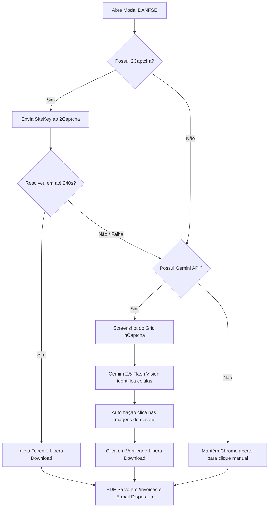

# 🧾 NFS-e Automator (Emissor Nacional)

> **Automação 100% autônoma de ponta a ponta para emissão de Nota Fiscal de Serviço eletrônica (NFS-e) no Portal Nacional da Receita Federal.**  
> Preenchimento automatizado das 4 etapas, resolução inteligente de captcha (2Captcha + Gemini Vision AI), download do DANFSE PDF, envio automático por e-mail para o tomador e notificação de auditoria para o administrador.

---

## 🌟 Destaques & Funcionalidades

- **🚀 Fluxo Hands-Free (Sem Interrupções)**:
  - Navega e autentica no [Emissor Nacional](https://www.nfse.gov.br/EmissorNacional/).
  - Preenche automaticamente as etapas:
    1. **Pessoas**: Cadastro do emitente, competência e consulta automática do CNPJ do tomador na Receita Federal.
    2. **Serviço**: Seleção de município (Select2), código de tributação nacional e descrição dos serviços.
    3. **Tributação e Valores**: Definição de valores, retenções e cálculo estimado de tributos (Decreto 8.264/2014).
    4. **Conferência e Emissão**: Confirmação automática de diálogos (`window.confirm`) e emissão oficial.
- **🤖 Dupla Camada de Resolução de Captcha (hCaptcha)**:
  - **Primária (2Captcha API)**: Resolução por token em segundo plano com timeout resiliente de até 240s (4 minutos).
  - **Fallback Visual (Gemini 2.5 Flash Vision AI)**: Se a API externa falhar ou expirar, o sistema tira um screenshot do desafio do hCaptcha, consulta o modelo multimodal da Google para identificar os quadrantes corretos e **executa os cliques automaticamente nas células do grid** do navegador, confirmando em seguida.
- **📦 Execução em Lote ou Individual**:
  - Emita todas as notas do mês com **um único comando** (`npm run emit:all`).
  - Emita para um cliente avulso especificando valor e descrição na linha de comando.
- **📧 Distribuição Automática por E-mail (Gmail SMTP)**:
  - Disparo do DANFSE PDF anexado para o cliente com assunto e corpo personalizados (variáveis `{{mes}}` e `{{ano}}`).
  - Suporte a remetente alternativo configurado no Gmail (`EMAIL_FROM`).
  - Envio de relatório de auditoria e cópia da nota para o administrador (`ADMIN_NOTIFY_EMAIL`).
- **🛡️ Alta Resiliência**:
  - Tratamento de instabilidade temporária do Serpro (erros 503 / *"The service is unavailable"* e falhas de recuperação de contribuinte) com *exponential backoff*.
  - Modo visível no navegador (*headed*) ou invisível (*headless*).
- **🔒 Segurança & Privacidade**:
  - `.gitignore` estrito para impedir o versionamento acidental de credenciais (`.env`), dados de clientes (`config.json`), PDFs emitidos (`invoices/`) e capturas de tela (`screenshots/`).

---

## 📁 Estrutura do Projeto

```text
notafiscalautomator/
├── emit.js               # Script central de automação e emissão (Playwright)
├── captcha-solver.js     # Módulo duplo de resolução de hCaptcha (2Captcha + Gemini Vision)
├── mailer.js             # Módulo de envio de e-mails com anexo (Nodemailer / Gmail)
├── send-email.js         # Utilitário para reenvio manual ou teste de e-mail de NFS-e
├── sync-clients.js       # Utilitário para importar clientes a partir de notas já emitidas
├── config.example.json   # Modelo de configuração de prestador, serviço e clientes
├── .env.example          # Modelo de variáveis de ambiente e chaves de API
├── package.json          # Dependências e atalhos de execução
└── .gitignore            # Proteção contra vazamento de credenciais e dados privados
```

---

## 🛠️ Pré-requisitos

- **Node.js** v18.0.0 ou superior
- **Google Chrome** instalado no sistema operacional
- Conta e credenciais de acesso ao [Portal Nacional da NFS-e](https://www.nfse.gov.br/EmissorNacional/) (CNPJ e senha)
- *(Opcional)* Chave de API do **2Captcha** ou **CapSolver** para resolução automática do hCaptcha
- *(Opcional)* Chave de API do **Google Gemini** para fallback de resolução visual de captcha via IA
- *(Opcional)* Senha de App do **Gmail** para envio automático de e-mails aos clientes

---

## 🚀 Instalação e Configuração

### 1. Clonar o Repositório
```bash
git clone https://github.com/williambulk/notafiscalautomator.git
cd notafiscalautomator
```

### 2. Instalar Dependências
```bash
npm install
```

### 3. Configurar Credenciais (`.env`)
Copie o arquivo de exemplo e preencha suas informações:
```bash
cp .env.example .env
```

Edite o arquivo `.env`:
```env
# Credenciais do Portal Nacional (NFS-e)
cnpj=00000000000000
senha=sua_senha_do_portal

# Resolução de Captcha (Preencha uma ou ambas para redundância)
TWOCAPTCHA_API_KEY=sua_chave_2captcha
GEMINI_API_KEY=sua_chave_google_ai_studio

# Disparo de E-mail (Gmail SMTP)
GMAIL_USER=seu_email@gmail.com
GMAIL_APP_PASSWORD=xxxx xxxx xxxx xxxx
EMAIL_FROM="Seu Nome" <seu_email@dominio.com.br>
ADMIN_NOTIFY_EMAIL=seu_email_admin@gmail.com
```

> 💡 **Como obter a Senha de App do Gmail**: Acesse [myaccount.google.com/apppasswords](https://myaccount.google.com/apppasswords) com a verificação em duas etapas ativada e crie uma senha para "Aplicativo de Notas Fiscais".

### 4. Configurar Prestador e Clientes (`config.json`)
Copie o modelo de configuração:
```bash
cp config.example.json config.json
```

Personalize os dados da sua empresa e a lista de clientes regulares:
```json
{
  "prestador": {
    "cnpj": "00.000.000/0001-00",
    "nome": "SUA EMPRESA LTDA",
    "municipio": "Curitiba",
    "uf": "PR",
    "codigo_ibge": "4106902"
  },
  "servico_padrao": {
    "codigo_tributacao_nacional": "01.03.02",
    "atividade": "Armazenamento ou hospedagem de dados, textos, imagens...",
    "descricao_padrao": "Mensalidade da manutenção do site",
    "municipio_prestacao": "Curitiba",
    "iss_retido": false
  },
  "clients": {
    "meu_cliente": {
      "name": "NOME DO CLIENTE LTDA",
      "cnpj": "11.222.333/0001-44",
      "default_value": "250,00",
      "description": "Mensalidade da manutenção do site",
      "email": {
        "enabled": true,
        "to": "financeiro@cliente.com.br",
        "subject": "Nota Fiscal - {{mes}} de {{ano}}",
        "body": "Olá, tudo bem?<br><br>Segue em anexo a nota fiscal deste mês.<br><br>Obrigado!"
      }
    }
  }
}
```

---

## 💻 Como Usar

### 1. Emissão em Lote (Todos os Clientes - Prompt Único)
Processa todos os clientes configurados no `config.json` em sequência, emitindo as notas, baixando os PDFs e disparando os e-mails automaticamente:
```bash
npm run emit:all
```

### 2. Emissão de um Cliente Específico
Emite a nota fiscal apenas para o apelido informado:
```bash
npm run emit -- --client meu_cliente --value 250
```

### 3. Simulação / Conferência (Dry-Run)
Navega pelos 4 passos, preenche todos os campos, tira screenshot da tela de conferência para validação visual e **não** conclui a emissão:
```bash
# Simular um cliente:
npm run dry-run -- --client meu_cliente

# Simular todos os clientes:
npm run dry-run:all
```

### 4. Teste de Login
Verifica se as credenciais do `.env` estão válidas e autentica a sessão:
```bash
npm run login
```

### 5. Reenvio Manual de E-mail
Reenvia o DANFSE por e-mail para um cliente:
```bash
npm run send-email -- --client meu_cliente
```

---

## 🤖 Como Funciona a Resolução de Captcha

O Emissor Nacional exige a resolução de um desafio **hCaptcha** para liberar o download do DANFSE (PDF). Este projeto resolve esse desafio de duas formas autônomas:



1. **Token Solver (2Captcha)**: Extrai dinamicamente a `sitekey` da página/iframe, requisita a solução via API e injeta o token `h-captcha-response`, liberando o download de forma silenciosa.
2. **Visual AI Clicker (Gemini Vision)**: Caso o serviço de token esteja indisponível, o script captura a tela do desafio visual, envia para o **Gemini 2.5 Flash**, que retorna os índices da matriz (1 a 9) correspondentes ao objeto solicitado. O Playwright simula os cliques humanos nas células e avança a verificação.

---

## 🔒 Segurança e Dados Sensíveis

Este repositório foi construído seguindo as melhores práticas de segurança:
- Nenhum CNPJ pessoal, senha, chave de API ou endereço de e-mail confidencial é armazenado no histórico do Git.
- Todos os arquivos gerados durante a execução (`invoices/*.pdf`, `screenshots/*.png`, `.auth/*`) estão explicitamente ignorados no `.gitignore`.
- Arquivos de exemplo limpos (`.env.example` e `config.example.json`) são fornecidos para facilitar o *setup*.

---

## 📄 Licença

Distribuído sob a licença MIT. Consulte `LICENSE` para mais informações.
